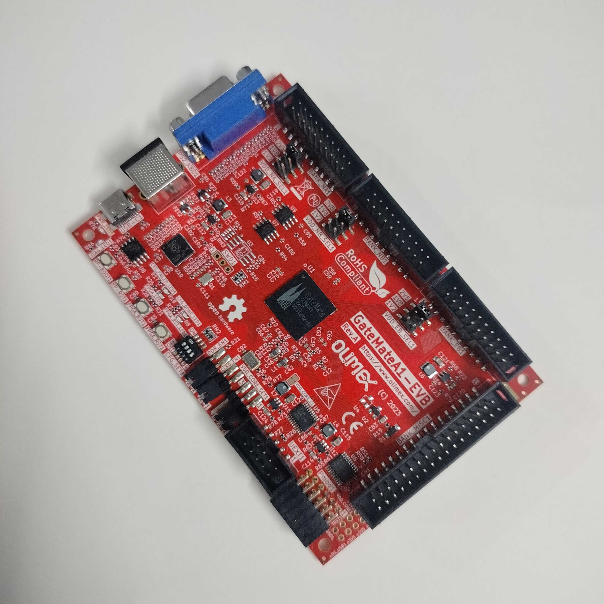
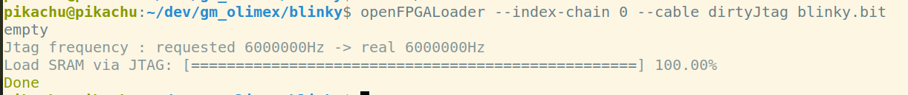

+++
title = 'Getting started with GateMate FPGA'
date = 2025-08-31T11:18:54+05:30
draft = false
+++


Hello everyone this is my first blog post in quite some time now so I have been a bit rusty.

I have got my self GateMate FPGA this time and we will see in the log how to get started with it.

The  [GateMateA1-EVB](https://www.olimex.com/Products/FPGA/GateMate/GateMateA1-EVB/open-source-hardware) one of the few dev-board based on the GateMate CCGM1A1 FPGA and it packs quite a lot of features and connectors as well . 

Like its VGA and PS2 keyboard connector. 



Now our task in this log is to setup the required EDA tool chain for the board and say hello world (blink an led). We will be using the OSS CAD tool chain as that is suggested by the company.

Few assumption made in this log
 * You are using linux ( Its ubuntu for me)
 * You how to navigate in linux thought terminal. 
 * Maybe you have programmed an FPGA before.

With that said lets get started the step zero is to get the tool chain. For that we would refer to the OSS-CAD's [Github](https://github.com/YosysHQ/oss-cad-suite-build) and download latest release.  

Now using the unzip tool of your choice unzip the tool chain in your preferred destination. I prefer to use this .

```
    tar -xvzf your_file_name.tgz -C /path/to/destination_directory/
```

Now transition to the newly created oss-cad-suite directory you should have these files.


Now we need to export the path for the system to be able use the tool chain 

``` 
    export PATH="<extracted_location>/oss-cad-suite/bin:$PATH" 
```

** Remember you would have to export this path every-time you open a new terminal . To solve you can add this your bashrc or set a alias for this . 

Now to verify if you have everything correctly try running 

```  
    nextpnr-himbaechel --version 
```

you should see a corresponding version number. 

I will assume that you have got this shorted out should ideally work however use internet or chatgpt to solve if issues occur.

Ok onces the we got the tool-chain set-ed up ..  to blink the led we need these files. 

   * Verilog (.v) file 
   * Pin Constraints (.ccf) file 


For blinking a led the verilog looks rather simple 

```   
    module top (
      input  clk,
      output  wire led
     );


      reg [20:0] counter = 0;

      always @(posedge clk) begin
        counter <= counter + 1;
      end

      assign led = counter[20];
    endmodule 

```

To create a pin constraint file we would need to know the pin number corresponding to the led and clock pin on the board while there isnt a direct list of those available on olimex website however doing some digging we can take them from the [schematic](https://github.com/OLIMEX/GateMateA1-EVB/blob/main/HARDWARE/GateMateA1-EVB-Rev.A/GateMateA1-EVB_Rev_A.pdf)  provided by the olimex . 

We can see from this schematic that  

  * LED pin is IO_SB_B6 
  * CLk pin is IO_SB_A8 

  (note that these will differ for other dev kits based on same FPGA)

We will use these and create our constraint file blink.ccf

```
    Pin_in   "clk"  Loc = "IO_SB_A8" | SCHMITT_TRIGGER=true;
    Pin_out  "led"  Loc = "IO_SB_B6"; # LED D1
```

Perfect now we have got all the files and tools we need it time to blink the led.

These are the steps we will follow. 
    
   1. Synthesis
   2. PNR 
   3. Bitstream Generation  
   4. flash(programme) the fpga 


### 1. Synthesis 

The OSS-CAD is a yosys project thus it uses yosys for synthesis :> 

We need to run this command for synthesis 

``` 
    yosys
    -ql <logfile>
    -p '
        read_verilog -sv <sources>; # read verilog files with sv support
        synth_gatemate
            -top <topmodule>        # top module name
            -luttree                # mandatory: enable luttree support
            -nomx8                  # mandatory: disable MUX8 support
            -nomult;                # optional: disable hardware multipliers
        write_json <netlist>.json;  # write JSON netlist for implementation
        write_verilog <netlist>.v   # optional:write verilog netlist

```

In our case the command will be 

```
    yosys 
        -p "read_verilog top.v; 
        synth_gatemate 
        -top top 
        -luttree -nomx8; 
        write_json blinky.json; 
        write_verilog blinky_netlist.v"
```

This flow generate's two files blinky.json and blinky_netlist.v in your directory now we will use those to do place and route.

### 2. Placement and Routing (PNR)

For pnr OSS-CAD use's next-pnr and specifically we will use nextpnr-himbaechel which has the gatemate arch support. 

The PNR requires these two files 
 * Netlist (.json) file 
 * Constraints (.ccf) file  

which we already have and the command to run pnr is 

```
    nextpnr-himbaechel
        --device=CCGM1A1        # GateMate device, select CCGM1A1 or CCGM1A2
        --json <netlist>.json   # input netlist after `yosys`
        -o ccf=<file>.ccf       # input CCF pin constraints file
        -o out=impl.txt         # output textfile for bitstream generation
        --sdc <constraints>     # optional: input SDC constraints file
        --router router2        # router, always select `router2
```

thus in our case this will become 

```
    nextpnr-himbaechel 
        --device=CCGM1A1 
        --json blinky.json 
        -o ccf=blinky.ccf 
        -o out=blinky.txt 
        --router router2
```

at the end of pnr we will get a blinky.txt that we will now use to pack the bitstream. 


#### 3. Bitstream Generation

To generate bitstream for GateMate fpga we have to  use gmpack tool and its straight forward.

This is the command to use it 

```
    gmpack
        --spimode <mode>    # optional: flash spi mode to use (single, dual, quad)
        --crcmode <mode>    # optional: crc error behaviour (check, ignore, unused)
        --background        # optional: enables background reconfiguration in flash mode
        <input>.txt         # input textfile after `nextpnr`
        <output>.bit        # output bitfile for programmer
```

Since we don't need spi mode (Olimex board usage jtag) and crc and background reconfiguration for us it will be 

```
    gmpack blinky.txt blinky.bit
```

this will create a bitstream file by name blinky.bit now next step will be to upload this file to the board. 

#### 4. Flashing the FPGA 

It time to take out the board out of the box and connect it to the laptop using the type C port on board.

For flashing the FPGA we will use openFPGALoader we have to use this command 

```
    openFPGALoader
        --index-chain <no>  # optional: device index in JTAG chain
        --freq <freq>       # optional: programmer frequency in Hz (default 6M)
        -b <board>          # gatemate_evb_jtag: jtag, olimex_gatemateebb: dirtyJtag
        <bitfile>           # input bitfile after `gmpack`
```
thus in our case this becomes 
```
    openFPGALoader --index-chain 0 --cable dirtyJtag blinky.bit 
```
You should see something like this in the terminal 



Congratulations we have the LED blinking on the board  


**Note:** some times the openFPGALoader might not have correct usb access to read write you can provide the correct acess if that ocurs (consult google/chatgpt for solution)


I have uploaded the complete code and a make file for the tool chain on my gihub [here](https://github.com/dpks2003/gatemate-lab) along with other examples. If you have any questions you can raise issue in that repo. 

### Useful Links 
  * [openCologne](https://github.com/chili-chips-ba/openCologne)
  * [Olimex-GateMate](https://github.com/OLIMEX/GateMateA1-EVB)
  * [Examples](https://github.com/YosysHQ/prjpeppercorn-test-cases)
  * [Peppercorn](https://github.com/YosysHQ/prjpeppercorn)
  * [Chili-chips](https://www.chili-chips.xyz/open-cologne/)
  * [GateMate](https://colognechip.com/programmable-logic/gatemate/)


Thank You For Reading 

With Love 

Deepak Sharda 


